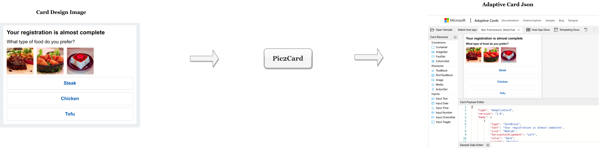
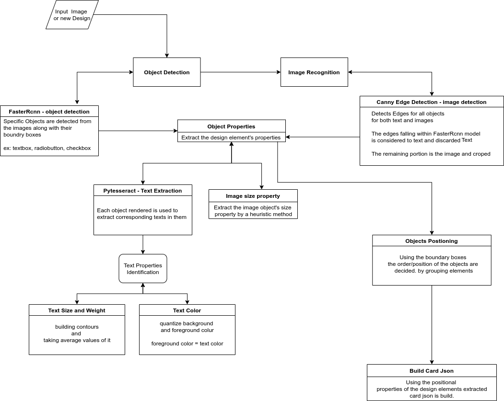

# Pic2Card
## Description
Pic2Card is a solution for converting adaptive cards GUI design image into adaptive card payload Json.





## Architecture



## Process flow for card prediction
1. Using the service

   On uploading or selecting any card design image templates ,


2. Using command

   ```
   python -m commands.generate_card --image_path="path/to/image"
   ```
   
   ​
## Training 
For training the custom design elements using the faster rcnn model, refer [here](https://tensorflow-object-detection-api-tutorial.readthedocs.io/en/latest/training.html).

After the Tensorflow and Tensorflow models intsallation:

1. create csv files for train and test images

  ```shell
  python commands/xml_to_csv.py
  ```

  ​

2. set configs for generating tf records

  ```python
  # TO-DO replace this with label map
  def class_text_to_int(row_label):
      if row_label == 'textbox':
          return 1
      if row_label == 'radiobutton':
          return 2
      if row_label == 'checkbox':
          return 3
      else:
          None
  ```

  ```shell
  #Generate tf records for training and testing dataset
  python commands/generate_tfrecord.py --csv_input=/data/train_labels.csv --image_dir=/data/train --output_path=/tf_records/train.record

  python commands/generate_tfrecord.py --csv_input=/data/test_labels.csv --image_dir=/data/test --output_path=/tf_records/test.record

  ```

  ​

3. Edit training/object-detection.pbxt file to match the label maps mentioned in generate_tfrecord.py

4. download any pre trained tensorflow model from [here](https://github.com/tensorflow/models/blob/master/research/object_detection/g3doc/detection_model_zoo.md) 

5. set below paths appropriately in pipeline.config file

  ```
  num_classes: -- number of labels
  fine_tune_checkpoint ---- path to faster_rcnn_inception_v2_coco_2018_01_28/model.ckpt
      tf_record_input_reader 
                 {
                      input_path: ---- full path to "tf_records/train.record"
                }
                label_map_path: ---- full path to "training/object-detection.pbtxt"
                  }
                  
      eval_input_reader: 
                 {
                tf_record_input_reader {
                  input_path: ---- full path to "tf_records/test.record"
                }
                label_map_path: ---- full path to "/training/object-detection.pbtxt"
                shuffle: false
                num_readers: 1
              }
  ```

  ​

6. train model using below command 

  ```shell
  python commands/train.py --logtostderr --model_dir=training/ --pipeline_config_path=../training/pipeline.config
  ```

  ​

7. export inference graph

  ```shell
  #After the model is trained, we can use it for prediction using inference graphs
  #change XXXX to represent the highest number of trained model 

  python commands/export_inference_graph.py --input_type image_tensor --pipeline_config_path training/pipeline.config --trained_checkpoint_prefix training/model.ckpt-XXXX --output_directory ../inference_graph
  ```

8. Can view the rcnn trained model's beaviour using the Jupyter notebook available under notebooks

  ​


